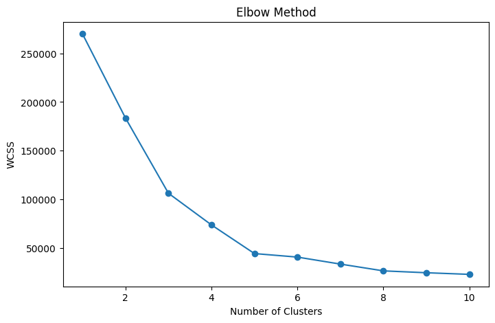
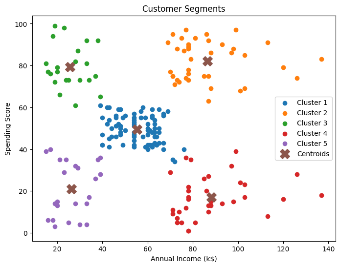

# 🛍️ Customer Segmentation using K-Means Clustering

## 📌 Overview

This project implements the **K-Means Clustering** algorithm to segment retail store customers based on their purchasing behavior.

Customer segmentation helps businesses better understand their customers, enabling personalized marketing strategies, targeted promotions, and improved customer engagement.

---

## 🎯 Objective

To group retail store customers into distinct clusters based on:

* Annual Income
* Spending Score

using the K-Means Clustering algorithm.

---

## 🛠️ Technologies Used

* Python
* Pandas
* NumPy
* Matplotlib
* Scikit-Learn
* Google Colab

---

## 📂 Dataset

The dataset contains customer information such as annual income and spending score, which are used for clustering analysis.

### Dataset Preview

---

## ⚙️ Project Workflow

1. Data Collection
2. Data Exploration
3. Feature Selection
4. Determining Optimal Number of Clusters
5. Applying K-Means Clustering
6. Visualizing Customer Segments
7. Analyzing Cluster Characteristics

---

## 🤖 Machine Learning Algorithm

### K-Means Clustering

K-Means is an unsupervised machine learning algorithm that groups similar data points into clusters based on feature similarity.

Features Used:

* Annual Income (k$)
* Spending Score (1–100)

---

## 📈 Elbow Method

The Elbow Method was used to determine the optimal number of clusters by analyzing the Within-Cluster Sum of Squares (WCSS).

---

## 📊 Customer Segmentation Results

The customers were successfully grouped into distinct segments based on their spending behavior and annual income.

### Customer Clusters

---

## 🔍 Insights

The clustering process helps identify:

* High-income, high-spending customers
* High-income, low-spending customers
* Low-income, high-spending customers
* Budget-conscious customers
* Average spending customers

These insights can assist businesses in developing targeted marketing campaigns and customer retention strategies.

---

## 📚 Key Learnings

Through this project, I gained practical experience in:

* Unsupervised Machine Learning
* K-Means Clustering
* Data Visualization
* Customer Segmentation Analysis
* Cluster Evaluation using the Elbow Method
* Implementing Machine Learning models with Scikit-Learn

---

## 🚀 Outcome

Successfully developed a customer segmentation model using K-Means Clustering to identify distinct customer groups based on purchasing behavior. This project enhanced my understanding of unsupervised learning techniques and their applications in business analytics.

---

## 👩‍💻 Author

**Divya Sai Sri Javvadi**

Machine Learning Internship Project – Task 2
